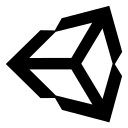

# Hi! I am RubixDev

- Website: **https://rubixdev.de**

- Discord: **Rubix#7875**
- [**LinkedIn**](https://www.linkedin.com/in/silas-groh-68956b236/)

## My Development Skills
#### Experienced

    
    
    
    
    
    
    
    
    
    
    
    

#### Intermediate

    
    
    
    

#### Bad / Learning

    
    

## My Stats

